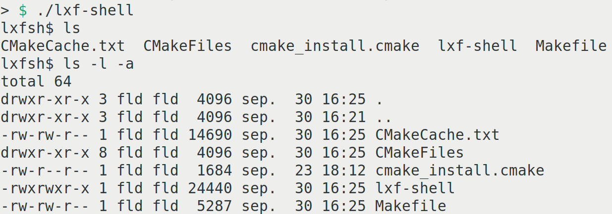
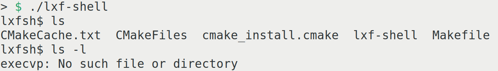
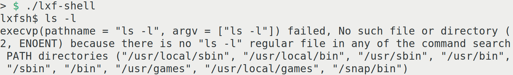
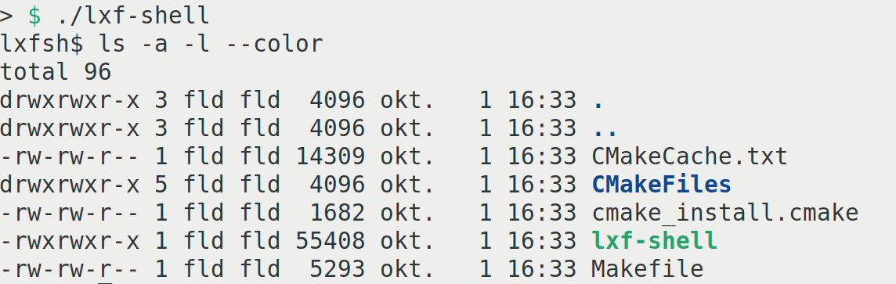

# Let’s write a Linux shell

In the Linux ecosystem, the "shell" is a crucial component—a command-line interface (CLI) program—enabling users to interact with the underlying operating system through text-based commands. It acts as a bridge, facilitating communication between users and the core components of the operating system, which manage hardware resources and system services. This article embarks on a fascinating journey on how to write a Linux shell from the ground up, offering readers a unique opportunity to explore the inner workings of such a fundamental tool.

Linux systems often support multiple shell options. While **Bash** is one of the most commonly used shells, there are others like **Zsh**, **Fish**, **KornShell**, **Nushell**, **Rush**, **Xonsh** and even **Csh**. Since under Linux we live in a free world, users can choose the shell that best suits their needs and workflow. 

While shells can be written in scripting languages like Python and Ruby, we're taking a more low-level approach for a modern spin. This article builds on the foundation of Chris Brown's article in Linux Format issue 149 from October 2011, providing a gentle guidance into programming a shell, with the twist of a fresh perspective. Switching from plain **C** to **C++**, we're using the **CMake** build system to streamline development and manage dependencies. 

Due to space constraints within this magazine, we'll provide only the essential introductory code snippets. Subsequently, we'll reference different sections for a comprehensive understanding. To access the complete code for this shell, please visit https://github.com/fritzone/lxf-shell. We strongly encourage our readers to explore the code and build it themselves to gain a wider perspective on how everything comes together (and we also have to mention, the code there has comments which were removed here for the purpose of keeping the size of the article manageable).

With all this in mind we can embark on the perilous journey of writing a Linux shell. From scratch. The main reason is actually not that the world needs another shell, as shown there are already a plethora of them, but more like to provide an opportunity to learn about the lower level Linux system internals, to give our readers a chance to understand how stuff works behind the scenes, and while doing this, to provide them with a basic introduction to build management with **CMake**, and to give a brief introduction to **C++**, as the choice programming language of this article.

## A quick introduction to CMake

**CMake** is an open-source cross-platform build system. Over the years it became the de-facto build system for C++ developers who need to manage the build process for their software projects in a platform-independent and, may I say so, in a quite efficient manner.

Just as a side-note, **CMake** stands for "Cross-platform Make."

Regardless that the syntax of it is considered… ehm… ugly by some members of the community, **CMake** has gained widespread adoption in the C++ software development community due to its ability to simplify the build process, promote cross-platform development, and provide a unified approach to managing project configurations and dependencies.

### Getting CMake

**CMake** comes by default in the repositories of most Linux distros, so normally it should be enough to install it using the package management tool of your system.

For Linux derivatives using `apt` as their package management tool this is (and should be very similar for `dnf` or `zypper` too):

```  bash
sudo apt install cmake
```

**CMake** also is present in the snap store, feel free to use that if you wish the latest version:

```bash
sudo snap install cmake --classic
```

Those wishing to overly complicate their life by balancing on the bleeding edge of the infamous double-edged sword of open source software development can download the latest sources from https://cmake.org/download/, and compile for themselves. But since they took this path the author assumes they have the necessary knowledge and will happily let them struggle with the process. 

### Your first CMake poject

To start using **CMake**, you typically follow these steps:

1. Create a `CMakeLists.txt` file in your project's source directory to define project settings, source files, and dependencies and executables (for now).
2. Create a build directory, to facilitate the out-of-source feature of **CMake** (and to not to mess up your source tree, because **CMake** generates a lots of intermediary build files).
3. Run **CMake** to configure your project, by specifying the directory where your `CMakeLists.txt` file is, then optionally specifying a generator (under Linux the default will be plain Makefiles), and build configuration options if needed (with the -D flag) at a later stage.
4. Build your project using the generated build files, such as Makefiles or project files, using your preferred build tool.

For the moment, we will start with the following, very basic example:

``` cmake
cmake_minimum_required(VERSION 3.15)
project(lxf-shell VERSION 1.0)
set(CMAKE_CXX_STANDARD 20)
set(${PROJECT_NAME}_SOURCES
    ${CMAKE_CURRENT_SOURCE_DIR}/main.cpp
)
add_executable(${PROJECT_NAME} ${${PROJECT_NAME}_SOURCES})
```

The first `CMakeLists.txt` example is very straightforward: sets minimum **CMake** requirements, creates a project (lxf-shell) and adds an executable, which will be again **lxf-shell**. The only tricky syntax is `${VARIABLE_NAME}` which is used to retrieve the value of the given variable. For our case the `project` keyword already set a variable called `PROJECT_NAME` so we retrieve it and use it to create another variable, which after the substitution will be named: `lxf-shell_SOURCES`.

All nice, so let's continue with the following short listing:

```cpp
#include <iostream>
#include <cstdlib>
int main()
{
	while(true)
	{
		std::cout << "lxfsh$ ";
		std::string command;
		std::getline(std::cin, command);
		if(command == "exit")
		{
			exit(0);
		}
		system(command.c_str());
	}
}
```

Our first C++ example (call it `main.cpp`) is also a very simple one: it creates a simple command-line interface that continually prompts the user for input via `std::getline`. It executes the entered command using the `system` function unless the user inputs "exit" at which point the program terminates. 

Make sure to save both of these files in the same directory, open a terminal, navigate to that directory, and once inside, create a build directory for the first iteration of the shell, and enter it:

```bash
mkdir build
cd build
```

And once in there, run **CMake** by specifying the directory where your `CMakeLists.txt` is to generate the corresponding build files and then make to build the project.

```bash
cmake ..
make
```

Running these two commands will build our current iteration of the shell, and from this point on, executing your newly built shell is as simple as just running:



And that’s it, except that ... there is just one issue with it. This does not behave like a proper shell, since the `system` call is just a clever wrapper around `fork` and `execl` and uses the default shell which should reside in `/bin/sh` of every decent Linux distro to execute the command.

## Fork, knife and the exec family

The previous paragraph I have to admit, might have sounded a bit scary, so before novice readers run away screaming here is a quick introduction to the mechanism employed by Linux to execute applications.

In the world of Linux programming, the `fork()` and `exec()` functions are used for creating new processes and starting applications. These functions play a crucial role in process management and are essential for tasks like running applications.

### **`fork()` **

The `fork()` function is used to create a new process in Linux. Don’t get confused, this does not mean yet that we have started a new application. When `fork()` is called, it essentially duplicates the existing process, creating an identical copy known as the child process. The child process is a separate execution context with its own memory space, but it starts execution from the same point as the parent process.

- Parent Process: The process that calls `fork()` is known as the parent process.
- Child Process: The newly created process is called the child process.

The `fork()` function returns different values to the parent and child processes. In the parent process, it returns the process ID (PID - a unique ID that... identifies the process) of the child process, while in the child process, it returns 0. This allows the parent and child processes to distinguish themselves, and also the parent to have some control over the child.

### **`exec()`**

The `exec()` function family is used to replace the current process image with a new one. After calling an `exec()` function, the existing program is terminated, and a new program is loaded into the same process space. This is commonly used to run external programs from within a C/C++ program.

At the current iteration of the shell we will use`execvp()` which allows passing on a set of argument to the application, and also searches for the program in directories listed in the `PATH` environment variable.

The `exec()` functions do not return if they are successful; instead, they load the new program, and the execution continues from there. If there's an error, they return -1.

Together, the `fork()` and `exec()` functions are used for a wide range of tasks, from creating complex multi-process applications to running different programs sequentially within a single process. They form the building blocks of process control and management in our favourite Linux's.

Armed with this knowledge we can now create finally a more properly functioning shell, like the following:

```cpp
#include <iostream>
#include <unistd.h>
#include <sys/wait.h>

int execute(const std::string& program) 
{
    pid_t child_pid;
    child_pid = fork();
    if (child_pid == -1) 
    {
        std::perror("fork");
        return 1;
    }
    if (child_pid == 0) 
    {
        const char* const arguments[] = {program.c_str(), nullptr};
        if (execvp(program.c_str(), (char* const*)arguments) == -1) 
        {
            std::perror("execvp");
            return 1;
        }
    } 
    else 
    {
        int status;
        waitpid(child_pid, &status, 0);
    }
    return 0;
}

int main()
{
    while(true)
    {
        std::cout << "lxfsh$ ";
        std::string command;
        std::getline(std::cin, command);
        if(command == "exit")
        {
            exit(0);
        }
        execute(command);
    }
}
```

And again: that's it. The `execute` function serves to execute a given command by forking a new process. It starts by creating a child process using the `fork()` system call. If the `fork` operation fails, it prints an error message and returns 1. In the child process (the true branch of the `child_pid == 0` check), it prepares the command and its arguments and attempts to execute it using `execvp()`. If `execvp()` encounters an issue, such as the command not being found, it prints an error message and returns 1 to indicate an error (which for the moment is ignored, but we'll deal with errors at a later stage).

In the parent process, the function waits for the child process to complete using `waitpid()`. This ensures that the parent doesn't continue executing until the child has finished its execution. If the command executes successfully, the function returns 0. Now, if you compile and execute the program above, you will be greeted again the familiar `lxfsh$` prompt and you again can execute programs:



Oops, that didn't go as well as expected, did it? What exactly is the problem with the `execvp` call, when you pass in a parameter to it? Right now all this is very cryptic, but fortunately for us, Linux comes with a handy library, just for complex situation like this. Its name is **libexplain** and as the name suggests it will explain stuff to us, mostly the reasons for our failures will be written a nice and understandable manner. If life would just have a libexplain...

## Explaining the unexplainable

To install the explainer library you should run (under Debian/Ubuntu):

```bash
sudo apt install libexplain-dev
```

Or its equivalent (dnf, zypper, etc...) for your respective distro. This will install the necessary development packages and headers for **libexplain**, and also the current version of the library. 

Now we need to tell **CMake** to find an external library, in our case it obviously **libexplain**. Add the following lines in your `CMakeLists.txt`, just after the `add_executable` command:

```cmake
find_library(LIB_EXPLAIN explain)
if(${LIB_EXPLAIN} STREQUAL "LIB_EXPLAIN-NOTFOUND")
    message(FATAL_ERROR "You need to install LibExplain to build this application")
else()
    message(STATUS "LibExplain found at: ${LIB_EXPLAIN}")
endif()
target_link_libraries(${PROJECT_NAME} ${LIB_EXPLAIN})
```

With these lines we have introduced several new commands for the aspiring **CMake** user: 

- `find_library`, as its name suggests, will try to find a library. The first parameter for this invocation is the name of a variable that **CMake** will store the result into, while the second one is the name of the library. In case CMake will fail to find the library in question, the value of this variable will be `"<VARNAME>-NOTFOUND"`, so for our case it will be: `"LIB_EXPLAIN-NOTFOUND"`. Since **libexplain** is a pretty standard Linux library, finding it requires none of the extra options `find_library`  can accept in case the libraries are in a non standard location, etc... so this concludes this command for now. Almost... please note how we had not used the **lib** prefix when looking for **libexplain**, just plain **explain**? That's how the correct syntax is.
- The `if` command, as its name suggests behaves like a classical if, it has a true branch from the `if` till the matching `else`, and a false branch from the `else` to `endif`, however not all `if`s must have an `else`. Please take note of how the value of the `LIB_EXPLAIN` variable is compared to the literal value of`"LIB_EXPLAIN-NOTFOUND"`. This is how you compare strings in **CMake**... ahem, did I mention that some developers find the syntax of **CMake** to behold a peculiar beauty? Then finally the `endif` command closes the `if`.
- The next new command that is used is `message`. As its name implies, it prints a message to the screen. Depending on the optional first parameter, which in our case is `FATAL_ERROR` used for really fatal situations, such as the inability to find a library, or `STATUS` as in the situation of I feel just saying something, the upcoming parameters are printed to the screen, and if there is not `FATAL_ERROR` for the first parameter, the execution just continues. Otherwise **CMake** will stop processing and will wait for the developer's remediation of the error. 
- The last **CMake** command introduced here is the `target_link_libraries`. Very suggestively it will instruct **CMake** to generate code sequences that will tell the linker to link our application with the libraries following. 

With all these prerequisites in place, we can head over to our `main.cpp` and it's time to kindly ask the newly introduced **libexplain** to explain us what the problem with `execvp` is. **libexplain** is a handy tool for explaining error situations for a list of supported functions, and thankfully `execvp` is among them.

Let's add the following include to the beginning of main.cpp:

```cpp
#include <libexplain/execvp.h>
```

and in the body of the `execute` method let's change the simplistic `std::perror("execvp")` to a more sophisticated looking:

```cpp
std::cerr << explain_execvp(program.c_str(), (char* const*)arguments) << std::endl;
```

Once you compile and run again, the following will be the response of the shell if you try again to convince it to run `ls -l`:



This is a lot more detailed, and it helps us identifying what the real problem is: `execvp` thought that we want to execute a program named `"ls -l"` instead of the program `"ls"` with the parameter `"-l"`, so obviously we have a few logic errors in our program. 

## Splitting up

Very specifically, for our situation trying to execute `"ls -l"`, `execvp` expects the following parameters:

```cpp
char *program = "ls";                        // Name of the program
char *arguments[] = {"ls", "-l", nullptr};   // Command-line arguments
```

but we are providing instead:

```cpp
char *program = "ls -l";                     // Name of the program
char *arguments[] = {"ls -l", nullptr};      // Command-line arguments
```

And now we see why it fails. There is just one resolution to our problem: we need to split the incoming command string, and build up a decent `char*` array from it, that `execvp` can work with. Splitting a string in C++ is not such a tedious task and it can be done in a few easy steps. A naive and straightforward implementation can be seen below:

```cpp
std::vector<std::string> splitStringByWhitespace(const std::string& input) 
{
    std::vector<std::string> result;
    std::istringstream iss(input);
    std::string token;
    while (iss >> token) 
    {
        result.push_back(token);
    }
    return result;
}
```

For the current iteration of the shell this will do, and in order to integrate the newly acquired function we shall modify our `execute` function to use it. The following piece of code goes into the `if (child_pid == 0)` branch, ie. the place where we start our child process after a successful fork:

```cpp
auto split = splitStringByWhitespace(program);
const char** arguments = new const char*[split.size() + 1];
size_t i = 0;
for(; i<split.size(); i++) arguments[i] = split[i].c_str();
arguments[i] = nullptr;
if (execvp(arguments[0], (char* const*)(arguments)) == -1) 
{
    std::cerr << explain_execvp(program.c_str(), (char* const*)(arguments)) << std::endl;
    return 1;
}
```

This iteration uses a vector called `split` to store the command's components, converts them to C-style strings, and places them in an array of `const char*` called `arguments`. A `nullptr` is added as the last element to terminate the argument list, and `execvp()` is called to execute the command. If `execvp()` fails, it prints an error message using a custom function (`explain_execvp()`) and returns an error code (1).

And with this in place we can finally build our shell again, and after starting it we can verify whether it accepts parameters to the commands as expected:



And yes, it works, finally our commands can be properly parametrized.

## A glimpse into the future

As we bring this article to a closure, we're excited to offer a glimpse into what the next installments have in store for you. In our upcoming episode, we'll explore the intricacies of command redirection. These fundamental concepts are essential for understanding how shells can manipulate data streams, allowing for even more powerful and versatile command-line experiences.

So, be sure to stay tuned for the upcoming chapters in our journey, in the meantime, keep those coding spirits high, and happy coding as you continue to explore the world of Linux programming!
